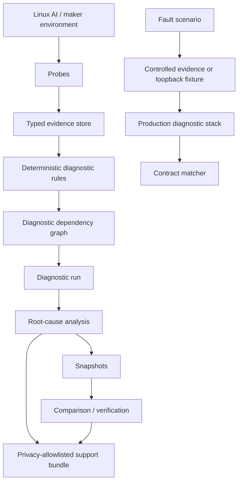

# Architecture

MakerMedic separates observation from interpretation. A probe reports typed
facts; a diagnostic rule decides what those facts mean. This boundary keeps
hardware access out of deterministic business logic and makes every rule
testable with controlled evidence.

## Probe is not diagnosis

Probes perform bounded observation: reading selected Linux interfaces, invoking
specific tools without a shell, importing optional libraries, or contacting an
explicit loopback service. They emit evidence keys and availability states.
They do not label an environment healthy or broken.

Rules consume evidence and return `PASS`, `WARN`, `FAIL`, `UNKNOWN`, or
`BLOCKED`. Given the same evidence, they return the same result. Rules never
access hardware or execute commands.

## Dependency-aware execution

The explicit graph validates dependency IDs and cycles, orders rules, and
prevents invalid downstream conclusions. When an upstream prerequisite is not
satisfied, the engine emits a `BLOCKED` result with stable blocker IDs rather
than reporting another failure.

The root-cause analyzer then identifies directly evaluated upstream findings,
classifies optional absence separately from failure, and records affected
downstream diagnostics.

## Persistence and sharing

Snapshots preserve diagnostic state and root findings without evidence values.
The comparator models availability changes separately from outcome changes, so
an unblocked check that now fails is not mislabeled as resolved.

Support bundles are built from one validated plan. Their evidence values pass
an explicit key and nested-field allowlist; unknown fields are omitted. Preview
and ZIP export consume the same plan.

## Validation laboratory

The lab controls input boundaries, then reuses production rules, graph, engine,
and analyzer. A generic matcher compares actual stable IDs and enums with each
scenario contract. Simulated scenarios do not inspect the host; the single
temporary-local scenario binds an ephemeral loopback HTTP server and cleans it
up in a `finally` path.
